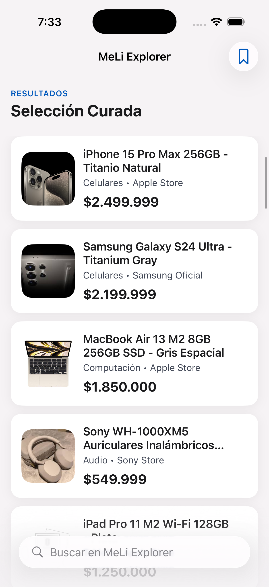
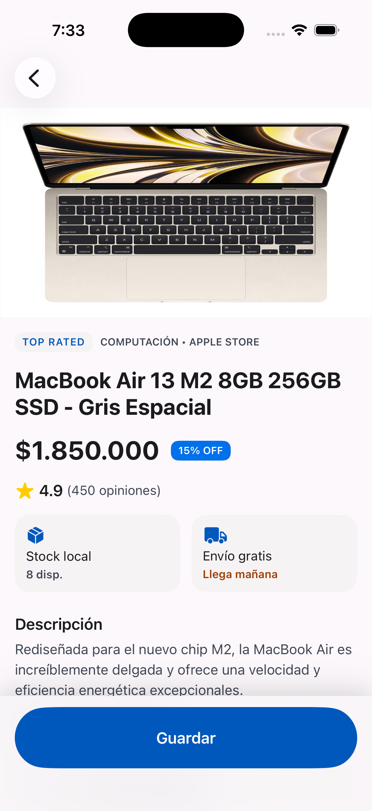

# MeLi Explorer

**Mobile AI Challenge — iOS**  
Candidato: Reinner Steven Daza Leiva

---

## Capturas de pantalla

| Search | Detail | Saved |
|--------|--------|-------|
|  |  |  |


---

## Descripción

MeLi Explorer es una app iOS nativa que permite explorar productos del marketplace Mercado Libre, ver el detalle de cada uno y guardar productos de interés con persistencia local entre reinicios.

Construida como solución al Mobile AI Challenge, la app prioriza **decisiones de producción** sobre completitud funcional: arquitectura mantenible, separación de capas estricta, manejo explícito de estados y testing automatizado de la lógica de negocio.

---

## Estructura del repositorio

```

├── src/
│   ├── MeLiExplorer/          ← Mini-App (Proyecto XcodeGen)
│   │   ├── App/
│   │   ├── Core/
│   │   ├── Features/
│   │   ├── Shared/
│   │   ├── Resources/
│   │   └── Tests/
│   ├── Designe Stitch/        ← Recursos visuales y mockups AI
│   └── PhotosEmulador/        ← Capturas del simulador real
└── run.md                     ← Pasos para correr la app y los tests   
└── functional_spec.md         ← Qué construir: pantallas, flujos, estados, criterios
└── technical_spec.md          ← Cómo construirlo: arquitectura, capas, persistencia, testing
└── validation_plan.md         ← Qué se valida, cómo y qué riesgo residual queda abierto
```

---

## Decisiones técnicas clave

### Arquitectura — MVVM estricto

La app sigue el patrón MVVM con una regla de dependencias unidireccional:

```
View → ViewModel → Repository → Model
```

Cada capa solo conoce a la inmediatamente inferior. Esto permite reemplazar cualquier capa —por ejemplo, sustituir `JSONProductRepository` por un repositorio que consuma la API real de Mercado Libre— sin modificar ningún ViewModel ni ninguna View.

### Stack tecnológico

| Categoría | Decisión | Justificación |
|-----------|----------|---------------|
| UI | SwiftUI | Framework nativo moderno, iOS 17+ |
| Estado | `@Observable` | Más performante que `ObservableObject` en iOS 17+ |
| Navegación | `NavigationStack` | Navegación programática con path tipado |
| Persistencia | SwiftData | ORM nativo de Apple, integración natural con SwiftUI |
| Imágenes | `AsyncImage` | Carga asíncrona nativa, sin dependencias externas |
| Datos | JSON local en bundle | Simple y reemplazable sin cambiar la arquitectura |
| Testing | Swift Testing | Framework moderno de Apple (Xcode 16+) |
| Dependencias externas | **Ninguna** | El scope no justifica paquetes SPM adicionales |

### Protocolo `ProductRepository`

Los ViewModels dependen del protocolo, nunca de la implementación concreta. Esto hace posible inyectar un `MockProductRepository` en tests sin infraestructura adicional y sustituir la fuente de datos en el futuro sin tocar la capa de presentación.

### Persistencia con SwiftData

Solo `SavedProduct` se persiste. El modelo `Product` del dominio es efímero —vive en memoria durante la sesión. Al guardar, se crea una copia de los datos del producto en ese momento, lo que garantiza que los favoritos no se pierdan si el JSON cambia.

### Búsqueda

El filtro opera 100% en memoria sobre los productos ya cargados al inicio. Se activa con 3 o más caracteres para evitar resultados confusos con queries muy cortos. Con menos de 3 caracteres se muestra la lista completa, decisión documentada explícitamente en la spec funcional como criterio de UX.

---

## Capacidades implementadas

### 1. Descubrimiento de productos
- Lista completa de productos visible al abrir la app
- Filtro en tiempo real por nombre (activado con 3+ caracteres)
- Estados manejados explícitamente: `loading`, `results`, `empty`, `error`

### 2. Detalle de producto
- Imagen, nombre, precio, categoría, vendedor, rating, stock y descripción
- Botón "Guardar" fijo en la parte inferior, fuera del área de scroll
- Estado del botón refleja en tiempo real si el producto ya fue guardado

### 3. Productos guardados
- Persistencia local entre reinicios con SwiftData
- Ordenados por fecha de guardado (más reciente primero)
- Eliminación con swipe-to-delete nativo de iOS
- Estado vacío cuando no hay productos guardados

---

## Fuera de scope

Las siguientes funcionalidades están explícitamente excluidas. El detalle completo se encuentra en `specs/functional_spec.md` sección 7.

- Checkout
- Recomendaciones
- Notificaciones push
- Autenticación
- Paginación
- Backend o integraciones de red propias
- Tests de UI automatizados (XCUITest)

---

## Diseño visual

El sistema de diseño sigue el concepto **"The Curated Marketplace"**: estética editorial, sin líneas divisoras, profundidad creada por capas de color y glassmorphism en elementos flotantes.

- **Paleta:** Índigo profundo (`#0058bc`) como color primario, superficies en tonos cálidos off-white
- **Tipografía:** Inter (con fallback a SF Pro), jerarquía tipográfica estricta
- **Componentes:** Tarjetas con corner radius `16pt`, sombras ambient de dos capas, sin separadores entre items
- **Dark Mode:** Soportado nativamente, con Ghost Border sutil en tarjetas para mantener límites visibles

---

## Uso de IA

El desarrollo utilizó herramientas de IA en las siguientes etapas:

**Generación de specs:** Las specs fueron generadas con asistencia de IA a partir de decisiones propias tomadas previamente. Cada decisión de scope, arquitectura y comportamiento fue definida antes de involucrar la IA.

**Diseño UI/UX:** Los mockups y el sistema de diseño fueron generados por una IA especializada en UI/UX a partir de un prompt detallado con los requisitos funcionales y técnicos de la app.

**Implementación:** El código fue generado bloque por bloque con asistencia de IA siguiendo un prompt maestro que define la arquitectura, convenciones y comportamientos esperados. Cada bloque fue revisado antes de continuar al siguiente.

**Lo que se aceptó:** Boilerplate de configuración, estructura base de ViewModels, tests unitarios con la estructura definida en la spec.

**Lo que se corrigió:** Convenciones de naming, ajustes de arquitectura donde la IA propuso soluciones más complejas de lo necesario, correcciones de accesibilidad en componentes visuales.

**Lo que se descartó:** Propuestas de coordinators y dependency injection containers que no se justifican para el scope del challenge.

---

## Requisitos

| Herramienta | Versión |
|-------------|---------|
| Xcode | 16.0+ |
| iOS Simulator | 17.0+ |
| macOS | 14.0 (Sonoma)+ |
| Swift | 5.9+ |

No se requieren dependencias externas ni configuración adicional.

---

## Correr la app y los tests

Ver [`run.md`](run.md) para instrucciones detalladas, incluyendo comandos de terminal y solución de problemas comunes.

```bash
# Abrir el proyecto
open MeLiExplorer.xcodeproj

# Correr la app: Cmd + R en Xcode
# Correr los tests: Cmd + U en Xcode
```

---

## Tests

11 casos automatizados con Swift Testing:

- **7 tests** sobre `SearchViewModel`: carga inicial, error, umbral de 3 caracteres, filtrado, estado empty, reset
- **4 tests** sobre `SavedProductStore`: guardar, eliminar, ciclo completo de persistencia con `ModelContainer` en memoria, protección contra duplicados

```
Test Suite 'All tests' passed
    Executed 11 tests, with 0 failures
```

---

## Autor

**Reinner Steven Daza Leiva**  
Mobile AI Challenge — iOS  
2026
